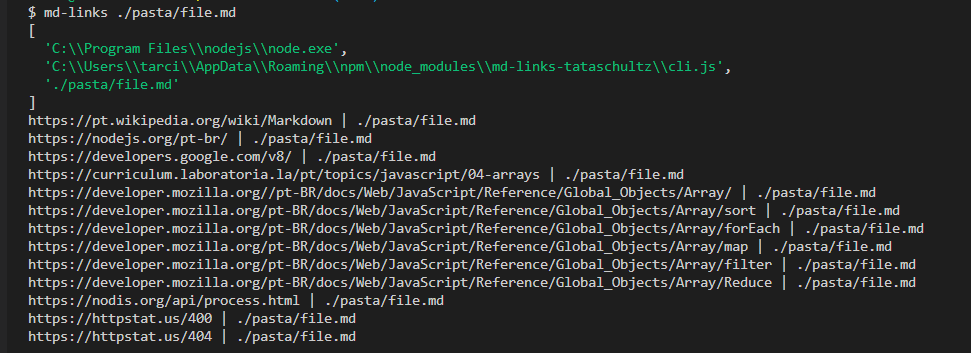
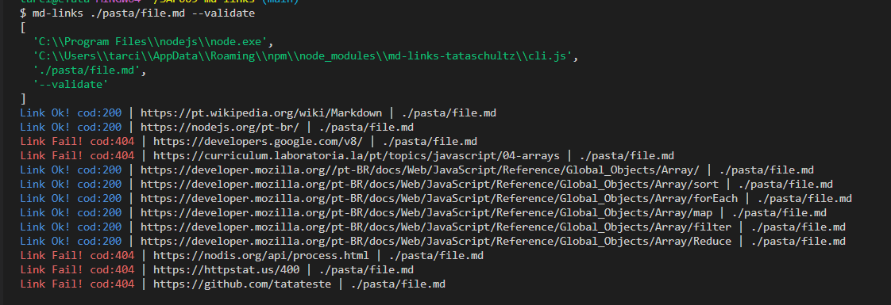
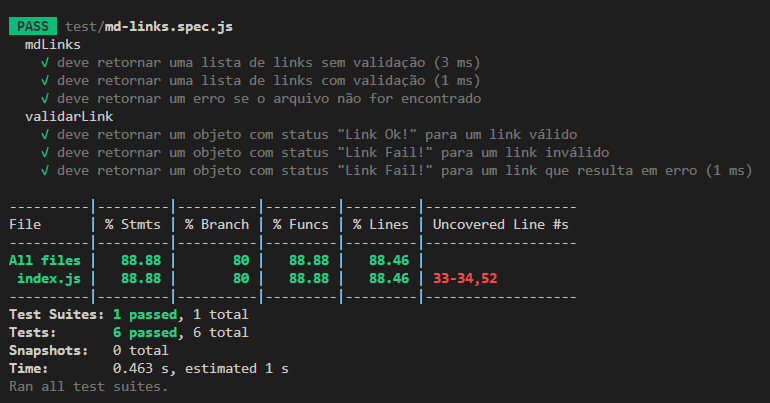

# Markdown Links

## Índice

* [1. Prefácio](#1-prefácio)
* [2. Resumo do projeto](#2-resumo-do-projeto)
* [3. Funcionalidades](#3-funcionalidades)
* [4. Considerações gerais](#4-considerações-gerais)
* [5. Instruçoes para utilização](#5-Instruçoes-para-utilização)

***

## 1. Prefácio

[Markdown](https://pt.wikipedia.org/wiki/Markdown) é uma linguagem de marcação
muito popular entre os programadores. É usada em muitas plataformas que
manipulam texto (GitHub, fórum, blogs e etc) e é muito comum encontrar arquivos
com este formato em qualquer repositório (começando pelo tradicional
`README.md`).

Os arquivos `Markdown` normalmente contém _links_ que podem estar
quebrados, ou que já não são válidos, prejudicando muito o valor da
informação que está ali.

## 2. Resumo do projeto

O projeto é uma ferramenta de linha de comando (CLI) e uma biblioteca em JavaScript para analisar arquivos Markdown e verificar os links contidos neles, fornecendo informaçoes sobre os links encontrados.

A ferramenta foi desenvolvida usando Node.js, um ambiente de execução para JavaScript que permite executar código JavaScript no sistema operacional. Isso nos permite interagir com sistemas de arquivos, fazer consultas de rede e realizar várias outras operações.

## 3. Funcionalidades

* Leitura e análise de arquivos Markdown
* Verificação de links quebrados ou inválidos
* Opção para realizar verificação assíncrona ou síncrona
* Opção para exibir detalhes dos links, como URL, texto do link e status HTTP

## 4. Considerações gerais

* Este projeto foi realizado individualmente.

* O projeto foi realizado em 3 semanas.

* A biblioteca e script executável (ferramenta de linha de comando - CLI) foram
  implementados em JavaScript para serem executadas com Node.JS.
  **Foi utilizada a biblioteca externa node-fetch**.

* Os testes unitários tiveram cobertura acima de 70% dos _statements_, _functions_,
  _lines_ e _branches_. 

* A ferramente foi desenvolvida utilizando o modelo de módulos do CommonJs, devido ao 
ambiente Node.js e para fins de conhecimento.

## 5. Instruçoes para utilização

* Essa biblioteca foi publicada no npm e para instalá-la, utilize o comando `npm install md-links-lab-009`
* Depois disso, utilize o comando `md-links ./caminhoDaPasta/nomeDoArquivo.md`que deseja consultar.

Com isso as informações dos links e suas respectivas pastas serão apresentadas no terminal da seguinte maneira:

* Para verificar a validaçao e os status dos links em seu arquivo .md, utilize o comando `md-links ./caminhoDaPasta/nomeDoArquivo.md --validate`
As informaçoes dos status serão printadas em seu terminal.

### Testes

